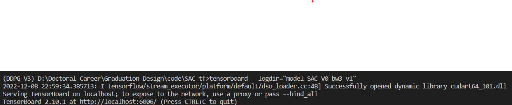
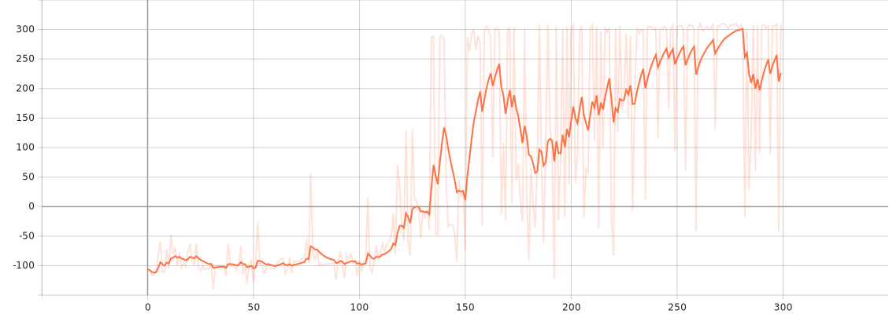

## requirements:
specially for hardcore version
### Computer environment
```
Anaconda
cuda&cudnn
```
### creating venv
```Anaconda
conda create -n SAC python==3.8.13
conda activate SAC
pip install -r requirements.txt
pip install gym[classic_control]
pip install gym[box2d]
pip install imageio[ffmpeg]
pip install imageio[pyav]
```

## test using the pre-train Model(Results)
```python
python SAC_V0_bw3_v1 --test
python SAC_V0_bw3 --test
python SAC_V0 --test
```

## train using the pre-train Model
```python
python SAC_V0_bw3_v1 --train
python SAC_V0_bw3 --train
python SAC_V0 --train
```

## load the previous model & train it
```python
python SAC_V0_bw3_v1 --train --load
python SAC_V0_bw3 --train --load
python SAC_V0 --train --load
```
## save the video
using 
```
python SAC_V0_bw3 --video
```
to save the video in the ./model_SAC_V0_bw3/video/

## Results
```
tensorboard --logdir="./"
```
open the host that below, like:


[video result](https://www.bilibili.com/video/BV1HP411T7zG/)
